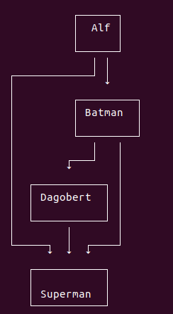
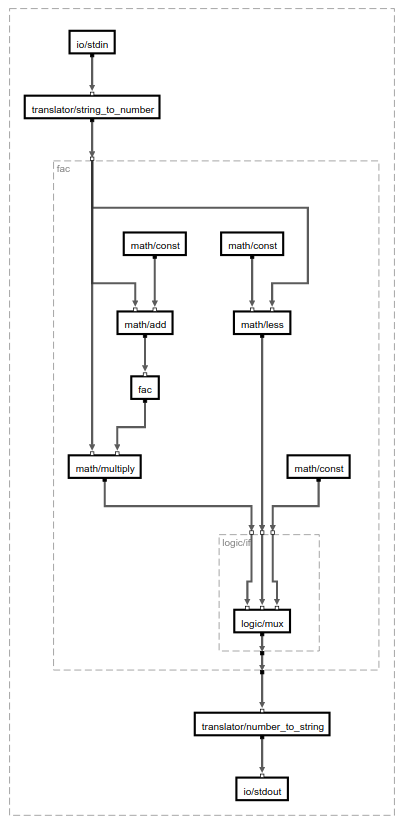

# Graphify

Create an graph layout for [Klay JSON Graphs](https://rtsys.informatik.uni-kiel.de/confluence/display/KIELER/JSON+Graph+Format).

This package itself will not create images of the graphs. It will only add information about the
sizes and positions of every node.

# Usage

You can install graphify via npm:

```
npm install graphify-node
```

## API

The API consists of one method `layout` that will create a layouted Klay JSON Graph.

```
const graphify = require('graphify-node')

// ...

function monospace (str, style) {
  return {width: str.length, height: str.split('\n').length}
}

graphify.layout(graph, monospace)
.then((layoutedGraph) => {
  console.log(JSON.stringify(layoutedGraph))
})
```

The layout function needs the graph and a method that specifies how to
measure the size of a text element. The terminal package below uses the
monospace implementation above, but if your environment supports fancy
font features the size estimation for a label will be more complex.

# Examples

The package [terminal-graphs](https://github.com/LittleHelicase/terminal-graphs) uses graphify to layout graphs
for the terminal.



In the [buggy project](https://github.com/BuggyOrg/buggy-cli) graphify is used to create layouts for SVGs and
web interfaces.



The [buggy implementation](https://github.com/BuggyOrg/graphify) uses a PhantomJS based font measurement in the
browser to accurately determine the dimensions of an text element.
